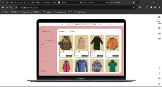

**Nombre**: proyectoWeb

**Ramas**:
	parte_1 (Landing pages de hamburguesa)
	parte_2 (Ecommer campus)

**Fecha límite de entrega**: Jueves 21 de marzo de 2024

**Normativa de commits**: conventional commits

**Detalles adicionales:** Se deben utilizar las tecnologías display: grid y display: flex en el desarrollo.	

**OPCIONAL** (5 pts adicionales):  😗  Debe ser responsive y manejar UI/UX a lo largo de todo el proyecto basado en el wireframe propuesto por el equipo de diseño.  exclusivo para la parte_2

Archivo **README**: Incluir dos gift que demuestren la funcionalidad responsive:
Dispositivos de escritorio y Celulares

## Ecommer campus

## Landing pages de hamburguesa

# Errores

